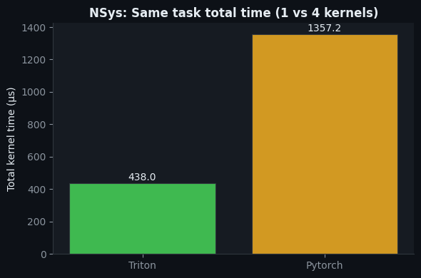
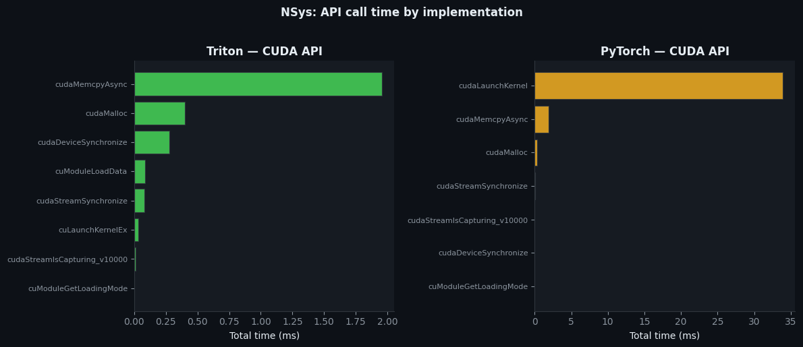
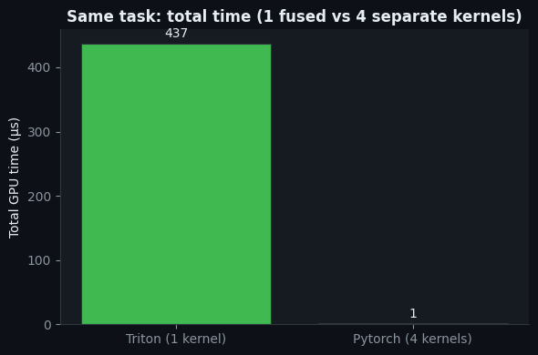
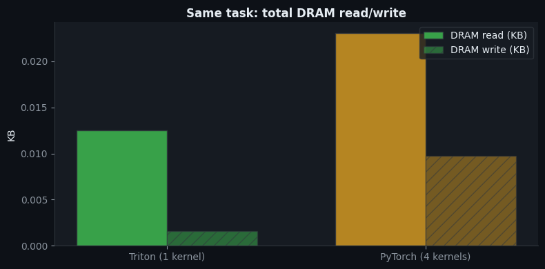
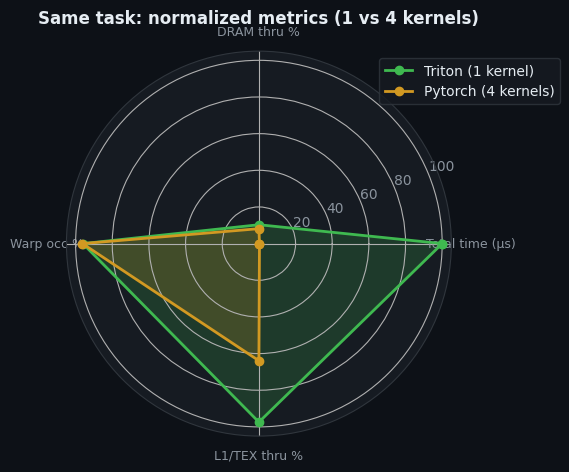

# Sigmoid + Top-K Fusion Benchmark (Triton vs PyTorch)

This repository benchmarks a fused Mixture-of-Experts (MoE) router path:

- **Triton fused kernel**: sigmoid + top-k in one custom kernel
- **PyTorch baseline**: `sigmoid()` + `topk()` via framework kernels

The project is introduced in the context of **Sarvam AI** optimization work, where **NVIDIA engineers** collaborated on deep inference optimization.  
This repo is **not** an official open-source release of Sarvam AI's production code; it is an **independent recreation** of optimization ideas discussed in public engineering posts.

## Reference Blog Posts

- [How NVIDIA Extreme Hardware-Software Co-Design Delivered a Large Inference Boost for Sarvam AI's Sovereign Models (NVIDIA)](https://developer.nvidia.com/blog/how-nvidia-extreme-hardware-software-co-design-delivered-a-large-inference-boost-for-sarvam-ais-sovereign-models/)
- [Accelerating MoE model inference with Locality-Aware Kernel Design (PyTorch)](https://pytorch.org/blog/accelerating-moe-model/)

---

## Repository Contents

- `sigmoid_topk_moe_fused_triton.py`  
  Triton implementation of fused router sigmoid + top-k (single kernel path).
- `sigmoid_topk_moe_fused_pytorch.py`  
  PyTorch baseline implementation (`logits.sigmoid().topk(...)`).
- `save_tensor.py`  
  Utility to generate and save a test tensor.
- `sigmoid_topk_benchmark_ncu.ipynb`  
  End-to-end profiling notebook (NCU + NSYS + plotting).
- `data/ncu_merged.csv`  
  Nsight Compute merged metric export.
- `data/nsys_merged.csv`  
  Nsight Systems merged report export.
- `img/`  
  Exported benchmark plots used below.

---

## What Is Being Optimized

MoE routing for each token row:
1. Compute sigmoid probabilities from router logits.
2. Select top-k experts.

### PyTorch path
- Uses built-in ops and dispatches multiple kernels for the full task.
- Simple and highly maintainable baseline.

### Triton fused path
- Runs a custom kernel that computes sigmoid and top-k in one flow.
- Avoids materializing the full sigmoid tensor to output memory.
- Reduces kernel launch count and memory traffic for the same routing task.

---

## How Metrics Are Collected

The notebook `sigmoid_topk_benchmark_ncu.ipynb` profiles both implementations with:

### Nsight Compute (`ncu`)
Kernel-level hardware counters:
- `gpu__time_duration.sum` (time, usually shown as `μs` in this README)
- `dram__throughput.avg.pct_of_peak_sustained_elapsed` (percentage of peak, `%`)
- `sm__warps_active.avg.pct_of_peak_sustained_active` (percentage of peak, `%`)
- `smsp__thread_inst_executed_per_inst_executed.ratio` (unitless ratio)
- `l1tex__throughput.avg.pct_of_peak_sustained_elapsed` (percentage of peak, `%`)
- `l1tex__data_bank_conflicts_pipe_lsu_mem_shared_op_ld.sum` (event count)
- `lts__t_sectors.avg.pct_of_peak_sustained_elapsed` (percentage of peak, `%`)
- `l1tex__t_sector_hit_rate.pct` (hit rate, `%`)
- `lts__t_sectors_srcunit_tex_op_read.sum` (sector count)
- `smsp__sass_average_data_bytes_per_sector_mem_global_op_ld.pct` (percentage, `%`)
- `dram__bytes_read.sum` (byte-family memory counter)
- `dram__bytes_write.sum` (byte-family memory counter)

### Nsight Systems (`nsys`)
System-level execution summaries:
- `cuda_gpu_kern_sum` (GPU kernel timeline summary; time in `ns`, shown as `μs` in tables)
- `cuda_api_sum` (CUDA API call overhead summary; time in `ns`, shown as `ms` in tables)

---

## Key Results (from `data/`)

Benchmark environment used for the results below:
- **Platform:** Google Colab
- **GPU:** NVIDIA Tesla T4
- **GPU Compute Capability:** **7.5** (as reported in profiling exports)

### Metric Unit Legend

- **Time:** `ns` (raw NSYS CSV), presented as `μs` or `ms` in this README.
- **Percentage utilization/hit-rate:** `%`.
- **Counts:** events/instances/sectors (dimensionless count family).
- **Ratios:** unitless.
- **Byte-family counters:** memory-volume counters from NCU (used primarily for relative comparison across implementations).

### TL;DR (Executive View)

| Signal | Triton Result | Why It Matters |
| --- | --- | --- |
| End-to-end kernel time (same routing task) | **3.10x faster** | Lower routing latency directly helps model serving responsiveness. |
| Kernel count for router path | **1 vs 4** | Fewer launches and less synchronization overhead. |
| CUDA API overhead in profile | **92.14% lower** | More time doing useful GPU work, less orchestration overhead. |

### NSYS comparison (task-level runtime)

Source: `data/nsys_merged.csv`

| Metric | Triton | PyTorch | Delta (PyTorch - Triton) | Triton Advantage |
| --- | ---: | ---: | ---: | ---: |
| GPU kernel time (`cuda_gpu_kern_sum`, μs) | 438.039 | 1357.220 | 919.181 μs | **3.10x faster** |
| Kernel instances (`cuda_gpu_kern_sum`) | 1 | 4 | 3 fewer kernels | **4x fewer launches** |
| CUDA API time (`cuda_api_sum`, ms) | 2.852 | 36.263 | 33.411 ms | **92.14% lower** |

### NCU comparison (hardware-counter aggregates)

Source: `data/ncu_merged.csv`  
Note: values below are aggregate counters across captured kernels.

| Metric (unit family) | Triton | PyTorch | Delta (PyTorch - Triton) | Triton Advantage |
| --- | ---: | ---: | ---: | ---: |
| DRAM read (`dram__bytes_read.sum`, byte-family counter) | 12.792128 | 23.618144 | 10.826016 | **1.85x lower** |
| DRAM write (`dram__bytes_write.sum`, byte-family counter) | 1.610560 | 9.994432 | 8.383872 | **6.21x lower** (`83.89%` reduction) |

### Extra comparison context

| Metric | Triton | PyTorch | Interpretation |
| --- | ---: | ---: | --- |
| Dominant routing pattern | 1 fused kernel | 4 separate kernels | Triton minimizes launch/sync overhead for router work. |
| API overhead share (`cuda_api_sum`) | Lower absolute runtime | Much higher absolute runtime | PyTorch path pays more launch and orchestration overhead for the same logical task. |

### Kernel Attribution (NSYS `cuda_gpu_kern_sum`)

Source: `data/nsys_merged.csv`

| Implementation | Kernel | Time (μs) | Share |
| --- | --- | ---: | ---: |
| Triton | `_sigmoid_topk_kernel` | 438.039 | 100.00% |
| PyTorch | `sbtopk::gatherTopK` | 1075.338 | 79.23% |
| PyTorch | `bitonicSortKVInPlace` | 215.387 | 15.87% |
| PyTorch | `vectorized_elementwise_kernel (sigmoid)` | 60.735 | 4.47% |
| PyTorch | `unrolled_elementwise_kernel (copy)` | 5.760 | 0.42% |

### API Attribution (NSYS `cuda_api_sum`)

Source: `data/nsys_merged.csv`

| Implementation | Top API call | Time (ms) | Share |
| --- | --- | ---: | ---: |
| Triton | `cudaMemcpyAsync` | 1.957 | 68.64% |
| Triton | `cudaMalloc` | 0.400 | 14.04% |
| Triton | `cudaDeviceSynchronize` | 0.279 | 9.77% |
| PyTorch | `cudaLaunchKernel` | 33.866 | 93.39% |
| PyTorch | `cudaMemcpyAsync` | 1.905 | 5.25% |
| PyTorch | `cudaMalloc` | 0.386 | 1.07% |

Taken together, these tables show why the fused Triton path is faster in this benchmark: fewer kernels, less API overhead, and lower memory traffic for MoE routing.

---

## Benchmark Methodology

- Both implementations are profiled for the same logical task: sigmoid + top-k routing on the same input tensor.
- Profiling mode uses single-iteration execution with warmup disabled (`-n 1 --no-warmup`) to capture kernel-level behavior cleanly.
- Triton profiling filters the custom kernel with `ncu -k regex:sigmoid_topk`.
- Results are merged into:
  - `data/ncu_merged.csv` for hardware counters.
  - `data/nsys_merged.csv` for kernel/API timing summaries.
- All values shown here are from the provided Colab T4 captures in this repository.

## Correctness and Scientific Rigor Checklist

To further strengthen this benchmark for external review, include:

- Numerical parity checks between Triton and PyTorch outputs (`topk_vals`) over multiple seeds/shapes.
- Top-k index agreement checks (`topk_idx`) and tie-handling notes.
- Repeated runs with statistics (`mean ± std`, and optionally p95) rather than single snapshots.
- Shape sweep tables over `(batch_size, num_experts, k)` to show where gains are strongest.
- Explicit environment versions (PyTorch, Triton, CUDA toolkit/driver) for reproducibility.

## Important Plots

### NSYS: Task-level kernel and API behavior

_This chart compares end-to-end GPU kernel time for the same routing task and shows Triton completing faster with a single fused kernel versus PyTorch's four-kernel path._

_This view highlights runtime/API overhead, showing that Triton spends much less time in CUDA API activity because it launches fewer kernels and synchronizes less._

### NCU: Per-kernel and memory behavior

_This figure breaks down per-kernel duration and reinforces that fusion removes intermediate kernels, reducing total routing latency._

_This memory-traffic comparison shows Triton performing fewer DRAM reads/writes for the same operation, which is a key reason for the speedup._

_This normalized multi-metric view summarizes the overall efficiency trend: Triton is stronger on time and memory-related dimensions for this workload._

---

## How To Reproduce

1. Create test tensor:
   - `python save_tensor.py -n 16384 -m 128 -o tensor.pt`
2. Run individual scripts:
   - `python sigmoid_topk_moe_fused_triton.py -f tensor.pt -k 2 -n 100`
   - `python sigmoid_topk_moe_fused_pytorch.py -f tensor.pt -k 2 -n 100`
3. Open and run:
   - `sigmoid_topk_benchmark_ncu.ipynb`
4. Ensure Nsight tools are installed and on `PATH`:
   - `ncu`
   - `nsys`

---

## Notes

- This benchmark uses specific tensor shapes and profiling settings; absolute numbers will vary by GPU and runtime setup.
- NCU counters are best interpreted with context (per-kernel and aggregate views together).
- The core takeaway remains consistent in this repo's data: **fusing router operations with Triton reduces overhead and improves efficiency over the baseline multi-kernel PyTorch path**.
- This is a focused microbenchmark of router fusion, not a full end-to-end LLM serving benchmark.
